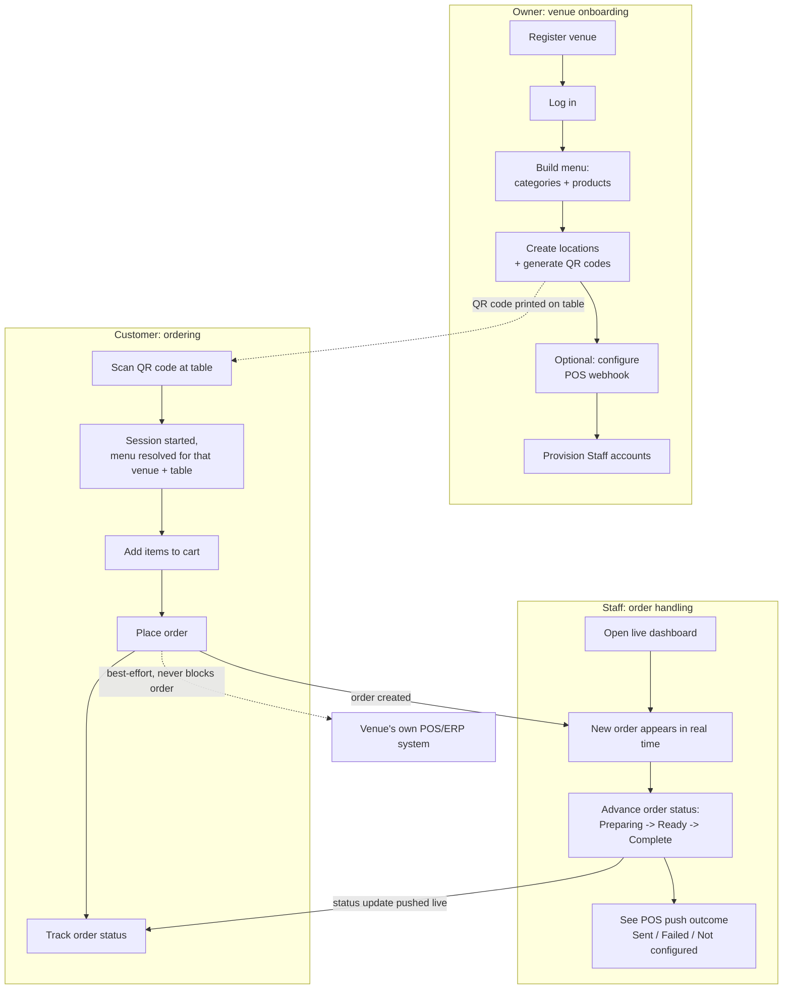

# PingMe — Functional Documentation

_Last updated: 2026-08-28 (Plans 1-5 complete)_

## 1. What PingMe Is

PingMe is a multi-tenant QR/NFC table-ordering platform for venues (restaurants, bars, cafés). A customer scans a QR code at their table, browses the menu, and places an order from their own phone — no app install, no waiter needed to take the order. Staff see new orders arrive live on a dashboard and manage each order's status. Each venue ("tenant") can optionally connect PingMe to its own POS/ERP system so new orders are also pushed there automatically.

Each venue's data (menu, locations, orders, staff, settings) is fully isolated from every other venue using PingMe. A venue only ever sees its own data, and this is enforced automatically at the database level — not just in application code.

## 2. Who Uses It

| Role | What they do |
|---|---|
| **Owner** | Registers the venue on PingMe, manages the menu (categories/products), manages table locations and QR codes, configures the optional POS integration, has full access to everything below. |
| **Staff** | Logs in with an Owner-provisioned account, watches the live order dashboard, updates order status as food is prepared and served. Cannot manage menu/locations/settings (Owner-only actions). |
| **Customer** | No account. Scans a QR code, gets a menu scoped to their table, places an order, can check its status. Fully anonymous — identified only by a short-lived session tied to the QR scan. |

## 3. Core Flows

### 3.0 End-to-end flow at a glance

### 3.1 Venue onboarding (Owner)
1. Owner registers the venue (venue name, owner email, password) — this creates the tenant, the Owner's account, and a default venue record in one step.
2. Owner logs in and receives a token used for all subsequent admin actions.
3. Owner builds the menu: creates a menu, adds categories, adds products (name + price) to each category.
4. Owner creates table locations (e.g. "Table 1", "Table 12", "Bar") and generates a QR code per location.
5. Owner prints/displays the QR code at the physical table.
6. (Optional) Owner configures a POS/ERP webhook so new orders are pushed to their existing kitchen/back-office system automatically.
7. Owner can invite/provision Staff accounts to work the floor without full Owner access.

### 3.2 Customer ordering
1. Customer scans the QR code at their table with their phone's camera → opens a link.
2. PingMe resolves the QR code to the venue and that specific table/location, and starts an anonymous session for this visit.
3. Customer sees the venue's menu, scoped correctly to that venue (never another venue's menu).
4. Customer adds items to a cart and places the order.
5. Customer receives an order confirmation and can poll for the order's current status (e.g. Received → Preparing → Ready).
6. If the venue has a POS integration configured, the order is also silently pushed to the venue's own system in the background — this never affects the customer's experience, even if the push fails.

### 3.3 Staff order handling
1. Staff logs in and opens the live order dashboard.
2. New orders for their venue appear on the dashboard in real time as customers place them — no manual refresh needed.
3. Staff advances each order through its lifecycle (e.g. mark as being prepared, mark as ready/complete) and the change is reflected live for anyone else watching the same dashboard.
4. Staff can see, per order, whether it was also successfully pushed to the connected POS system (or that push failed / no POS is configured) — this is informational only; it never blocks staff from handling the order in PingMe itself.

## 4. Feature Inventory

- **Multi-tenant venue accounts** — each venue is fully isolated (menu, locations, orders, settings, staff).
- **Owner/Staff roles** — Owner has full admin access; Staff has order-handling access only.
- **Menu management** — menus → categories → products, each with name and price, products can be marked available/unavailable.
- **Table locations & QR codes** — one QR code per physical table/location; scanning one identifies both the venue and the table for the resulting order.
- **Anonymous customer ordering** — no signup required for customers; a scan starts a short-lived ordering session for that visit.
- **Order placement & status tracking** — customers place multi-item orders and can check status; orders progress through a defined lifecycle (e.g. Received → Preparing → Ready/Complete).
- **Live staff dashboard** — real-time order feed and status updates via a persistent connection (no polling needed on the staff side).
- **POS/ERP push integration (Level 1)** — an Owner can point their venue at a webhook URL; every new order is automatically and best-effort forwarded there as soon as it's placed, with the delivery outcome recorded and visible to staff. A POS/ERP push failure never affects the customer's order.

## 5. What's Explicitly Not Built Yet

These are known, intentional gaps — not bugs:

- **No Owner-facing admin web UI for menu/locations/catalog management** — an Owner currently manages the menu, locations, and QR codes via the raw API (through Swagger), not a dedicated screen. Only the Staff order dashboard has a real UI today.
- **No two-way POS sync** — PingMe only pushes new orders outward. It cannot pull menu data, stock levels, or order status back from a POS system.
- **Only one POS connection method** — a single generic webhook. Direct integrations with specific POS vendors (e.g. ZoneSoft, Primavera, WinRest) don't exist yet; a venue must have (or build) something on the receiving end of the webhook.
- **No payment processing** — PingMe handles ordering, not payment. Payment is assumed to happen through the venue's existing means (pay at counter, existing card terminal, etc.).
- **No customer accounts, order history, or loyalty features** — every customer interaction is anonymous and scoped to a single visit.
- **No production deployment** — PingMe currently runs locally / via local Docker Compose only. See the Infrastructure & Maintenance guide for what's needed before hosting it for real.
