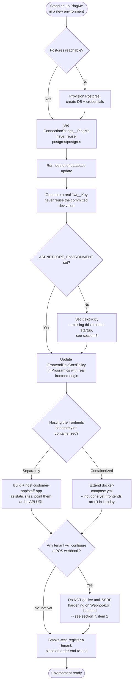

# PingMe — Infrastructure & Maintenance Guide

_Last updated: 2026-08-28. Written for whoever operates, deploys, or does a maintenance pass on PingMe — treat this as the "what to check / what to change" consultation guide, not a feature walkthrough (see `technical-documentation.md` for that)._

## 1. Current State — Read This First

**PingMe has never been deployed to a real server.** Everything that exists today is aimed at local development:

- Backend runs via `dotnet run` on the developer's machine, or via a local `docker-compose.yml` (API + Postgres only).
- Frontends (`customer-app`, `staff-app`) run via `pnpm dev` — they are **not** containerized and are not part of `docker-compose.yml`.
- There is **no CI/CD pipeline** anywhere in the repo.
- There is **no cloud hosting target** chosen or configured (no Azure/AWS/etc. config exists).
- `docker-compose.yml` itself has only ever been verified by manual review — Docker was unavailable in the environment used to build Plan 4, so `docker compose up` has never actually been run end-to-end. **Run it once, for real, before trusting it.**

If you're being asked to "make PingMe production-ready," the honest starting point is: pick a hosting target, containerize the frontends (or serve them as static files from somewhere), stand up CI, and close the items in §7 below. None of that exists yet.

## 2. Standing Up a New Environment — Decision Flow



## 3. Configuration — Where Settings Live and What to Change

### 3.1 Backend configuration files

| File | Used when | Contains |
|---|---|---|
| `src/PingMe.Api/appsettings.json` | Always (base) | Logging config only. **No connection string or secrets here.** |
| `src/PingMe.Api/appsettings.Development.json` | `ASPNETCORE_ENVIRONMENT=Development` | `ConnectionStrings:PingMe`, `Jwt:Key`/`Issuer`/`Audience`/`ExpiryMinutes` — **all dev-only values, including a plaintext JWT signing key.** |
| `docker-compose.yml` (repo root) | `docker compose up` | Same settings as above, injected as environment variables (`ConnectionStrings__PingMe`, `Jwt__Key`, etc.) into the `api` service. |

**There is currently no `appsettings.Production.json` and no environment-variable-based secrets setup for a real deployment.** Anyone standing up a real environment must:
1. Create the missing config surface (a `Production` appsettings file, or — preferably — inject everything via environment variables / a secrets manager, following the same `ConnectionStrings__PingMe` / `Jwt__*` naming ASP.NET Core already expects).
2. **Generate a new `Jwt:Key`.** The one committed in `appsettings.Development.json` is a throwaway dev value (`"dev-only-signing-key-change-before-production-1234567890"`) — it must never be used outside local dev.
3. Point `ConnectionStrings:PingMe` at the real database, with real credentials — never reuse `postgres`/`postgres`.

### 3.2 Ports (local dev)

| Service | Port |
|---|---|
| API (native `dotnet run`) | `5190` (HTTP), `7060` (HTTPS) — see `src/PingMe.Api/Properties/launchSettings.json` |
| API (via `docker-compose.yml`) | `5190` on the host, mapped to `8080` inside the container |
| Postgres (native dev) | `5432` |
| Postgres (via `docker-compose.yml`) | `55432` on the host, mapped to `5432` inside the container — deliberately different from native dev's `5432` so both can run side by side without conflict |
| `customer-app` (Vite dev server) | `5173` |
| `staff-app` (Vite dev server) | `5174` |

If you add a new environment (staging, prod), these all need real values — nothing here is dynamically discovered.

### 3.3 CORS

`Program.cs` defines `FrontendDevCorsPolicy`, hardcoded to `http://localhost:5173` and `http://localhost:5174`. **This must be updated with the real frontend origin(s) before any non-local deployment**, or both frontends will be silently unable to call the API from a real browser (this exact failure mode already happened once during Plan 4 — it's invisible to the automated test suite because `WebApplicationFactory` bypasses browser-level CORS enforcement entirely).

## 4. Database & Migrations

- EF Core Code-First migrations live in `src/PingMe.Infrastructure/Persistence/Migrations/`.
- **The `pingme_dev` database does not auto-migrate on API startup** — you must run migrations manually:
  ```
  dotnet ef database update --project src/PingMe.Infrastructure --startup-project src/PingMe.Api
  ```
  (Run this any time you pull new commits that included a migration, or after a fresh `docker compose up` on a new volume.)
- **`pingme_test` (used by the integration test suite) *does* auto-migrate** — `PingMeWebApplicationFactory` runs `Database.Migrate()` on construction, every test run. Don't rely on this behavior anywhere outside the test project.
- Two tenant-scoping conventions to know before touching the schema:
  - Every entity implementing `ITenantOwned` automatically gets a non-unique `TenantId` index via a loop in `PingMeDbContext.OnModelCreating` — you don't need to add one by hand.
  - If you need a *unique* per-tenant constraint (like `TenantPosIntegrationSettings.TenantId` or `QrCode.Code`), add your own explicit `HasIndex(...).IsUnique()` call **before** that loop runs — EF Core merges multiple `HasIndex` calls on the same property set into one index, and only an explicit `.IsUnique()` call sets uniqueness. Get the ordering/coexistence wrong and you can silently lose the uniqueness constraint.

## 5. Running Things Locally (Quick Reference)

**Backend, native:**
```
dotnet ef database update --project src/PingMe.Infrastructure --startup-project src/PingMe.Api   # first time / after new migrations
dotnet run --project src/PingMe.Api
```
Requires `ASPNETCORE_ENVIRONMENT=Development` to be set (or use the default launch profile, which sets it) — without it, the API falls back to `appsettings.json` alone, which has **no connection string**, and will crash on startup with `InvalidOperationException: The ConnectionString property has not been initialized.`

**Backend, Docker Compose:**
```
docker compose up
```
(Never independently verified end-to-end in this environment — smoke-test it before relying on it.)

**Frontends:**
```
cd src/pingme-web/customer-app && pnpm install && pnpm dev   # http://localhost:5173
cd src/pingme-web/staff-app && pnpm install && pnpm dev      # http://localhost:5174
```

**Full test suite:**
```
dotnet test PingMe.slnx                                       # backend: unit + integration
cd src/pingme-web/customer-app && pnpm test && pnpm build
cd src/pingme-web/staff-app && pnpm test && pnpm build
```

## 6. Secrets & Sensitive Values Checklist

Before any deployment beyond a developer's own machine, rotate/relocate every one of these — none of them are safe to reuse from the committed dev config:

- [ ] `Jwt:Key` — currently a hardcoded, committed dev value. Generate a strong random key per environment.
- [ ] Postgres credentials — currently `postgres`/`postgres` everywhere. Use real, unique credentials per environment, injected via secrets/environment variables, never committed.
- [ ] `Jwt:Issuer`/`Jwt:Audience` — currently fixed strings (`"PingMe"`/`"PingMeAdmin"`) shared across all environments; low risk on their own, but keep them consistent between the token issuer and any downstream verifier if you split services later.
- [ ] Any tenant-configured `WebhookUrl` (Plan 5's POS integration) — **not currently validated for SSRF**. A malicious or careless Owner could point this at an internal address. This is explicitly flagged in `Docs/superpowers optimized/plans/PROGRESS.md` as a required fix before letting tenants self-serve this field in production.

## 7. Known Gaps to Close Before Production

In rough priority order:

1. **SSRF hardening on `WebhookUrl`** (Plan 5) — the single highest-priority security gap. A tenant can currently point their POS webhook at any URL, including internal/private network addresses; PingMe's server will make the request. Needs allow-listing, DNS-resolution checks against private IP ranges, or similar, before self-serve configuration goes live.
2. **Real `Jwt:Key`/secrets management** — see §6.
3. **CORS origins** — see §3.3.
4. **No CI pipeline** — nothing currently runs `dotnet test` / `pnpm test` automatically on push or PR. Set one up before this is a team project rather than a solo one.
5. **Frontends aren't containerized / have no deployment target** — decide on static hosting (e.g. behind a CDN) vs. containerizing them alongside the API.
6. **No production `appsettings` / environment separation** beyond `Development` — see §3.1.
7. **Docker Compose has never been run for real** — verify it actually works before depending on it for anything.
8. **A rare concurrency bug in POS settings** (Plan 5 review finding, tracked in `PROGRESS.md`): two near-simultaneous first-time `PUT /admin/pos-integration` calls from the same tenant can race the unique index into an unhandled 500 instead of cleanly resolving to one saved row. Low likelihood (requires a literal double-click race), but worth a `catch (DbUpdateException)`-and-retry fix at some point.
9. **No Owner-facing admin UI** for menu/locations/QR/POS-settings management — these are only reachable via the raw API/Swagger today. Not a technical debt item so much as a missing feature, but relevant to "what does an Owner actually do day-to-day" if this goes live.

## 8. Where to Look for More Detail

- **Why a given decision was made the way it was**: `session-log.md` at the repo root — searchable `[saved]` entries per session, with rejected alternatives noted.
- **Task-by-task build history for each feature area**: `Docs/superpowers optimized/plans/*.md` — one file per plan (Plans 1-5), each with a full task list and a final self-review section.
- **Cross-plan status and all "carried forward" / deferred items in one place**: `Docs/superpowers optimized/plans/PROGRESS.md`.
- **Original design rationale for POS/ERP integration specifically**: `Docs/superpowers optimized/specs/2026-08-26-pingme-pos-integration-design.md`.
