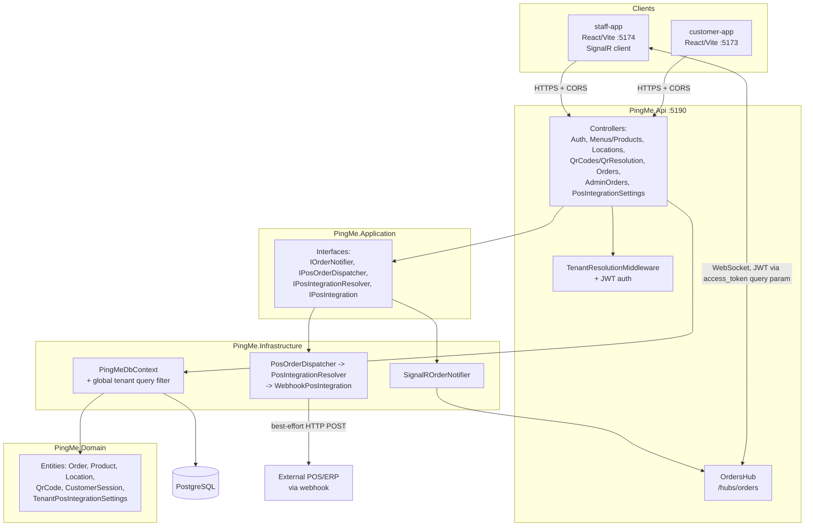
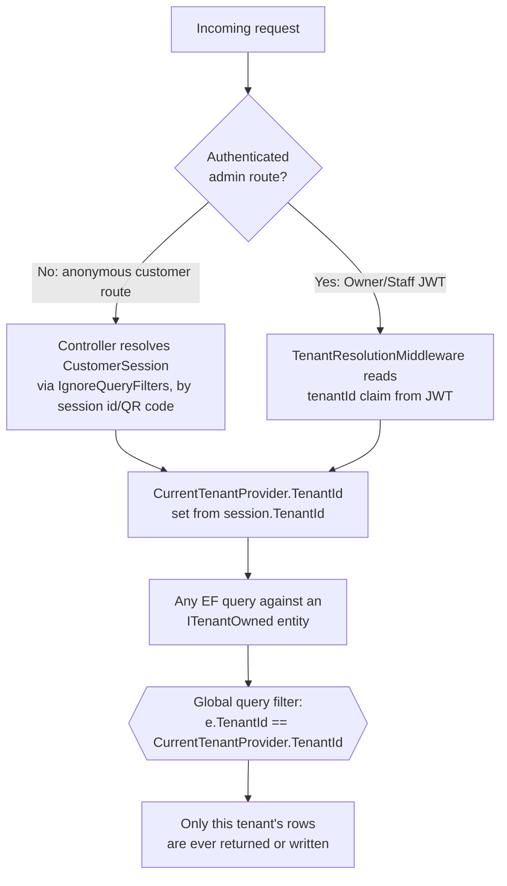
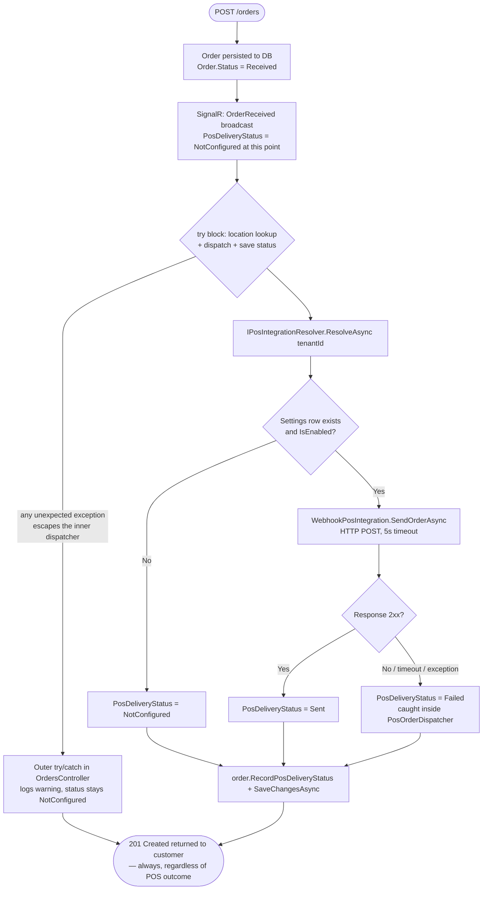

# PingMe — Technical Documentation

_Last updated: 2026-08-28 (Plans 1-5 complete, all merged to `main`)_

## 1. Stack

| Layer | Technology |
|---|---|
| Backend | .NET 10 / ASP.NET Core, C# |
| Database | PostgreSQL, accessed via EF Core (Npgsql provider) |
| Auth | ASP.NET Core Identity + JWT bearer tokens |
| Real-time | SignalR |
| Frontend (customer) | React 18 + TypeScript + Vite |
| Frontend (staff) | React 18 + TypeScript + Vite + `@microsoft/signalr` |
| Testing | xUnit (unit + integration, via `WebApplicationFactory`), Vitest (both frontends) |
| Package management | NuGet (backend), pnpm workspace (frontend, both apps in one workspace) |
| Containerization | Docker Compose (API + Postgres only, dev-oriented) |

## 2. Architecture at a Glance



**Request flow, tenant isolation, and the POS-dispatch call chain are covered in detail in §5, §6, and §9.**

## 3. Solution Layout

```
src/
  PingMe.Domain/          — entities, enums, no framework dependencies
  PingMe.Application/     — interfaces/seams (DTOs, service contracts), depends only on Domain
  PingMe.Infrastructure/  — EF Core DbContext, migrations, concrete implementations of Application interfaces
  PingMe.Api/             — ASP.NET Core host: controllers, DI wiring (Program.cs), SignalR hubs, JWT config
  pingme-web/
    customer-app/         — Vite/React app, anonymous customer ordering flow
    staff-app/            — Vite/React app, authenticated staff order dashboard (SignalR client)
tests/
  PingMe.UnitTests/        — pure unit tests, no DB, hand-written fakes (no mocking library)
  PingMe.IntegrationTests/ — WebApplicationFactory-based HTTP tests against a real Postgres test DB
Docs/
  superpowers optimized/plans/   — one file per implementation plan, task-by-task history
  superpowers optimized/specs/   — design docs behind each plan
```

**Dependency direction:** `Api → Infrastructure → Application → Domain`. Domain has zero framework/EF dependencies. This is a strict layering — do not add EF/ASP.NET references to Domain or Application.

## 4. Domain Model (by module, under `PingMe.Domain/`)

- **Tenants** — the tenant/venue concept and its identity plumbing.
- **Catalog** — `Product`, `ProductOption`, menus/categories (Catalog admin owns the menu structure).
- **Locations** — `Location` (a physical table/area), `QrCode` (one per Location, unique `Code`), `CustomerSession` (anonymous, created when a QR code is resolved — carries `LocationId` and scopes an ordering visit).
- **Ordering** — `Order` (has `Status`, `CreatedAt`, `Items`, `PosDeliveryStatus`), `OrderItem`.
- **Integrations** — `TenantPosIntegrationSettings` (one row per tenant, unique on `TenantId`), `ProviderType` enum (`Webhook` today), `PosDeliveryStatus` enum (`NotConfigured`/`Pending`(unused)/`Sent`/`Failed`).
- **Common** — `Entity` base class (`Guid Id`), `ITenantOwned` marker interface (any entity implementing this is automatically tenant-scoped — see §6).

All entities follow the same convention: **private setters + explicit mutation methods** (e.g. `order.RecordPosDeliveryStatus(status)`, `settings.UpdateSettings(...)`) — never expose a public setter on a domain entity.

## 5. API Surface (`PingMe.Api/Controllers/`)

| Controller | Access | Purpose |
|---|---|---|
| `AuthController` | Anonymous | `POST /auth/register-tenant` (creates tenant + Owner + default venue), `POST /auth/login` |
| `MenusController` / `ProductsController` | Owner | Menu/category/product CRUD |
| `LocationsController` | Owner | Table/location CRUD |
| `QrCodesController` | Owner | Generate a QR code for a Location (unique-index + retry-on-collision against races) |
| `QrResolutionController` | Anonymous | `GET /p/{code}` — resolves a scanned QR code into venue + menu + a new `CustomerSession` |
| `OrdersController` | Anonymous (session-scoped) | `POST /orders` (place an order), `GET /orders/{id}/status` |
| `AdminOrdersController` | Owner/Staff | `GET /admin/orders` (live list), `PUT` status transitions |
| `PosIntegrationSettingsController` | Owner | `GET`/`PUT /admin/pos-integration` — configure the tenant's POS webhook |

Swagger/OpenAPI is enabled in Development (`app.MapOpenApi()` / `UseSwaggerUI()`), disabled otherwise.

## 6. Multi-Tenancy

Enforced by a **global EF Core query filter**, applied automatically in `PingMeDbContext.OnModelCreating` to every entity implementing `ITenantOwned`:

```csharp
foreach (var entityType in modelBuilder.Model.GetEntityTypes())
{
    if (typeof(ITenantOwned).IsAssignableFrom(entityType.ClrType))
    {
        // applies e.TenantId == _currentTenantProvider.TenantId to every query
    }
}
```

`ICurrentTenantProvider` / `CurrentTenantProvider` (scoped per-request) holds the current tenant ID, set by `TenantResolutionMiddleware` from the caller's JWT `tenantId` claim (or from the resolved `CustomerSession` for anonymous customer endpoints). Because the filter is global, **any new `ITenantOwned` entity is automatically tenant-isolated with zero extra code** — this is the load-bearing convention of the whole codebase; do not bypass it with `IgnoreQueryFilters()` outside of the few places that intentionally need to (e.g. resolving a `CustomerSession` by its own ID before the tenant context exists).



## 7. Auth

- ASP.NET Core Identity (`AppUser`, `IdentityRole<Guid>`) backs Owner/Staff accounts.
- JWT bearer tokens carry `sub` (user id), `tenantId`, `email`, and the ASP.NET role claim.
- `Jwt:Key`/`Issuer`/`Audience`/`ExpiryMinutes` come from configuration (see Infrastructure guide for where these live per environment).
- SignalR's `/hubs/orders` hub authenticates over WebSocket by reading the JWT from an `access_token` query-string parameter (browsers can't set `Authorization` headers on the WS upgrade) — this exception is scoped narrowly to that one path in `Program.cs`'s `JwtBearerEvents.OnMessageReceived`.

## 8. Real-Time (SignalR)

- `OrdersHub` (`/hubs/orders`) — `[Authorize(Roles = "Owner,Staff")]`. On connect, joins the caller's connection to group `tenant-{tenantId}` (from the JWT claim).
- `IOrderNotifier` / `SignalROrderNotifier` — the seam controllers call to broadcast; wraps `IHubContext<OrdersHub>` and swallows/logs any broadcast failure (never lets a SignalR problem fail the HTTP request that triggered it).
- Events: `OrderReceived` (on `POST /orders`), `OrderStatusChanged` (on admin status transitions).
- **Known limitation:** the `OrderReceived` payload's `PosDeliveryStatus` field is always `"NotConfigured"` at the moment it's broadcast, because POS dispatch happens after that broadcast fires. Staff only see the real POS outcome by re-fetching `GET /admin/orders`. This is a deliberate scope decision (see Plan 5), not a bug.

## 9. POS/ERP Integration (Plan 5)



- `PosOrderDispatcher` wraps the whole resolve+send sequence in try/catch — any failure (unreachable host, timeout, non-2xx, bad config) becomes `PosDeliveryStatus.Failed`, never an exception that reaches the customer.
- The call in `OrdersController.Create` is itself wrapped in a second try/catch (added during Plan 5's review) so that even a failure in the *surrounding* code (the location lookup, or the second `SaveChangesAsync` that persists the status) cannot turn an already-committed order into an HTTP 500.
- The webhook `HttpClient` has a 5-second timeout (`Program.cs`, `AddHttpClient(nameof(WebhookPosIntegration), ...)`) — dispatch happens **inline** during `POST /orders`, so this bounds worst-case added latency on every customer order.
- `ProviderType` is validated with `Enum.TryParse` + `Enum.IsDefined` (rejects both unknown names and undefined numeric values); `WebhookUrl` must parse as an absolute `http`/`https` URI. Both checks live in `PosIntegrationSettingsController.Upsert`.
- **Known limitation (tracked in `PROGRESS.md`):** `WebhookUrl` accepts any tenant-supplied URL with no SSRF hardening — acceptable for the current MVP/dev phase, **must be fixed before any production rollout** that lets a tenant self-serve a webhook URL pointing anywhere on the internet or internal network.

## 10. Testing Conventions

- **No mocking library anywhere in this codebase.** Unit tests use hand-written fake implementations of interfaces (e.g. `FakeResolver`/`FakeIntegration` in `PosOrderDispatcherTests`); HTTP-level tests stub `HttpMessageHandler` directly to capture outgoing requests without a real socket.
- Integration tests spin up the whole API in-memory via `WebApplicationFactory` (`PingMeWebApplicationFactory`) against a real Postgres test database (`pingme_test`), running EF Core migrations automatically on factory construction.
- SignalR hub tests force `HttpTransportType.LongPolling` — the in-memory `TestServer` doesn't support real WebSockets.
- Current count (as of Plan 5): 11 unit tests, 52 integration tests — all run via `dotnet test PingMe.slnx`.

## 11. Frontend Notes

- `customer-app` and `staff-app` are independent Vite apps sharing one pnpm workspace (`src/pingme-web/`).
- `staff-app`'s SignalR client registers all `.on()` event handlers **before** calling `connection.start()` — this ordering is load-bearing; registering handlers after start can silently drop a broadcast that arrives in the gap (a real bug found and fixed during Plan 4's review).
- Both apps call the API via CORS (`Program.cs`'s `FrontendDevCorsPolicy`), not same-origin — required for local dev where each runs on its own Vite port.
- `AdminOrderDto`'s `posDeliveryStatus` field was added in Plan 5 but is not yet consumed by `staff-app`'s TypeScript types or UI — it's present in the JSON but not rendered.
